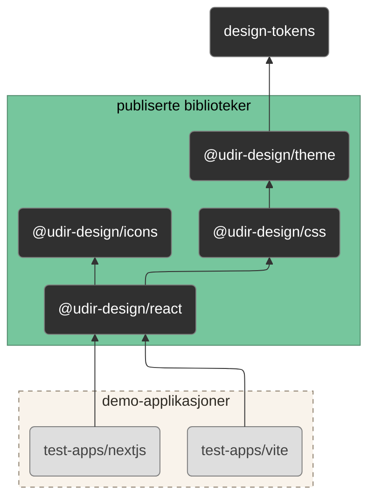

# Designsystem for Utdanningsdirektoratet <!-- omit from toc -->

Udirs designsystem skal bidra til å skape og opprettholde helhetlig design slik at Udir har:

- tydelig identitet
- brukervennlige løsninger
- effektiv utvikling

Udirs designsystem tar utgangspunkt i [Digdirs felles designsystem](https://www.designsystemet.no/). Designsystemet skal brukes for å oppnå helhetlig design i Udirs digitale tjenester og i andre kommunikasjonsflater i tråd med Udirs [designprofil](https://www.udir.no/om-udir/designprofil/).

I dette repositoriet lever den delen av designsystemet som implementeres i kode:

- design tokens
- komponentbibliotek
- dokumentasjon

## Innholdsfortegnelse <!-- omit from toc -->

<!--
  Innholdsfortegnelsen er generert av extension "Markdown All in One" for VS Code.
  Om du har extensionen installert vil innholdsfortegnelsen automatisk oppdateres.
  https://marketplace.visualstudio.com/items?itemName=yzhang.markdown-all-in-one
-->

- [Hvordan ta i bruk Udirs designsystem](#hvordan-ta-i-bruk-udirs-designsystem)
- [Versjonering og publisering](#versjonering-og-publisering)
  - [Livsfaser for en komponent](#livsfaser-for-en-komponent)
- [Hva tester vi?](#hva-tester-vi)
  - [Individuelle komponenter](#individuelle-komponenter)
  - [Demosider](#demosider)
  - [Smoketest (Next.js)](#smoketest-nextjs)
  - [Felles for komponenter og demosider](#felles-for-komponenter-og-demosider)
  - [Tester for komponenter i ulike livsfaser](#tester-for-komponenter-i-ulike-livsfaser)
- [Informasjon for utviklere som skal bidra](#informasjon-for-utviklere-som-skal-bidra)
  - [Oppsett lokalt](#oppsett-lokalt)
  - [Monorepo - enkelt forklart](#monorepo---enkelt-forklart)
  - [Hvordan jobbe med kodebasen](#hvordan-jobbe-med-kodebasen)
  - [Hvordan legge til nye pakker i monorepoet](#hvordan-legge-til-nye-pakker-i-monorepoet)
  - [Hvordan håndtere avhengigheter](#hvordan-håndtere-avhengigheter)
  - [Hvordan oppdatere symboler](#hvordan-oppdatere-symboler)
  - [Hvordan publisere en ny versjon](#hvordan-publisere-en-ny-versjon)
  - [Oversikt over verktøy](#oversikt-over-verktøy)
- [Thanks](#thanks)

# Hvordan ta i bruk Udirs designsystem

> [!IMPORTANT]
> For å bruke designsystemet i et React-prosjekt, trenger du kun å forholde deg til komponentbiblioteket `@udir-design/react`.
>
> Instrukser for å komme i gang finnes i [komponentbibliotekets README](./@udir-design/react/README.md).

# Versjonering og publisering

Bibliotekene våre følger [semantisk versjonering](https://semver.org/) og [semantisk publisering](https://semantic-release.org/).

Det vil si, gitt et versjonsnummer MAJOR.MINOR.PATCH, vil

- en økning i MAJOR-versjon indikere en endring som **ikke** er bakoverkompatibel
- en økning i MINOR-versjon indikere ny, bakoverkompatibel funksjonalitet
- en økning i PATCH-versjon indikere en bakoverkompativel bugfiks

Koden som tilhører siste stabile, publiserte versjon vil alltid finnes på branchen [release/latest](https://github.com/Utdanningsdirektoratet/designsystem/tree/release/latest), mens koden for en spesifikk versjon kan finnes via [git tags](https://github.com/Utdanningsdirektoratet/designsystem/tags).

> [!WARNING]
> Foreløpig finnes ikke branchen `release/latest`, fordi vi ikke har publisert en stabil versjon ennå.

## Livsfaser for en komponent

Komponenter i designsystemet kan befinne seg i én av tre ulike livsfaser:

<dl>
<dt><strong>Alpha</strong></dt><dd>Komponenten er implementert, men dokumentasjon er mangelfull. Den er ikke nødvendigvis testet i en større kontekst, og det er sannsynlig at utseende, oppførsel og/eller API vil endre seg.</dd>
<dt><strong>Beta</strong></dt><dd>Designteamet har tatt valg for hvordan komponenten skal se ut og oppføre seg. Den har fått bruksdokumentasjon i Storybook og Figma, og er en del av en demoside der den kan testes i en større kontekst. Det finnes automatiserte tester av komponenten der det gir mening. Endringer er fremdeles mulig basert på tilbakemeldinger fra systemteam og manuell testing.</dd>
<dt><strong>Stabil</strong></dt><dd>Komponenten er vurdert til å tilfredsstille systemteamenes behov. Designteamet har gjort denne vurderingen basert på kjennskap til Udirs tjenester og tilbakemeldinger fra systemteamene i alpha- og betafasene. Stabile komponenter har gjennomgått akseptansetest i designteamet. Vi prøver å unngå endringer i stabile komponenter med mindre det ligger gode grunner bak.</dd>
</dl>

> [!WARNING]
> I **alpha**- og **beta**-fasene vil følgende gjelde:
>
> - endringer som bryter bakoverkompatibilitet kan skje når som helst, uten at MAJOR-versjonsnummeret endres
> - komponentene må importeres fra riktig undermodul:
>   - `@udir-design/react/alpha` gir tilgang til alpha, beta og stabile komponenter
>   - `@udir-design/react/beta` gir tilgang til beta og stabile komponenter
>   - `@udir-design/react` gir kun tilgang til stabile komponenter

### Overgang fra beta til stabil

Vi legger ut melding på Slack-kanalen #designsystem-udir når vi mener en komponent kan gå fra beta til stabil. Hvis vi ikke får noen innsigelser på dette, setter vi komponenten til stabil etter cirka en uke.

# Hva tester vi?

I designsystemet har vi flere nivåer av automatisert testing for alle komponenter.
Vi publiserer aldri nye versjoner av komponentbiblioteket før alle nye eller endrede komponenter har bestått disse testene.

Alle våre automatiserte tester kjører i nettleseren Chromium.

## Individuelle komponenter

Vi bruker **komponenttester** for å teste hvordan individuelle komponenter rendrer ut i nettleseren i ulike tilstander og etter ulike brukerinteraksjoner.

### Oppførsel

I de tilfellene vi implementerer egen oppførsel for komponenter eller hjelpefunksjoner, bruker vi **enhetstester** for å teste denne oppførselen isolert.

## Demosider

Vi tester hver komponent i en større kontekst av andre komponenter. Dette kaller vi **komposisjonstester**. Her kan vi også teste interaksjoner på tvers av komponenter.

## Smoketest (Next.js)

Vi smoketester Next.js-testapplikasjonen i produksjonsmodus og besøker alle demosidene. Testen verifiserer at hver side rendres uten feil, og fanger opp problemer som ikke oppdages av komponent- eller komposisjonstester — for eksempel biblioteker som krasjer under server-side rendering (SSR).

## Felles for komponenter og demosider

Både komponenttester og komposisjonstester er basert på eksempler (engelsk: _stories_) i Storybook. I tillegg til det som er beskrevet over, får hvert eksempel også automatisk en snapshottest, en visuell test, og en regelbasert UU-test.

**Snapshottester** avdekker uventede endringer i HTML-markupen som blir generert fra hver enkelt komponent, og **visuelle tester** avdekker uventede visuelle endringer i komponentene. Om det er endringer i markup eller utseende vurderer designteamet endringen manuelt for å avgjøre om den er godkjent eller ikke.

Vi bruker [Axe](https://github.com/dequelabs/axe-core) til **regelbaserte UU-tester** for å avdekke vanlige brudd på universell utforming. Disse reglene, som er [beskrevet i Axe sin dokumentasjon](https://github.com/dequelabs/axe-core/blob/master/doc/rule-descriptions.md), kan ikke fange opp alle brudd. Vi supplerer derfor de regelbaserte testene med andre UU-tester som vi gjennomfører i samarbeid med UU-eksperter fra Udirs testteam. Dette kan være manuelle testrutiner eller automatiserte komponent- og komposisjonstester.

> [!WARNING]
> Komponenter fra designsystemet er i tråd med UU-tilsynets krav til
> universell utforming. Det betyr ikke at digitale tjenester som bruker
> designsystemet automatisk blir universelt utformet. Komponentene må også
> settes sammen på riktig måte i grensesnittene for at systemet skal være
> universelt utformet. Systemteamene må derfor selv sørge for å oppfylle
> kravene til universell utforming i sine tjenester.
> Vi anbefaler å kontakte Udirs testteam for bistand til UU-test av systemer.

## Tester for komponenter i ulike livsfaser

For en **alpha**-komponent gjelder dette:

- Det finnes minst ett eksempel for den individuelle komponenten

For en **beta**-komponent gjelder dette:

- Det finnes eksempler for den individuelle komponenten i relevante tilstander og interaksjoner
- Komponenten er testet i minst én komposisjonstest

En **stabil** komponent har bestått alle testene i alpha- og beta-fasene og UU-testene som er beskrevet over.

# Informasjon for utviklere som skal bidra

Før du kan bidra med kode i designsystemet trenger du å gjøre noe oppsett lokalt. I tillegg trenger du å forstå hvordan kodebasen er strukturert på et overordnet nivå. Deretter får du vite hvordan du jobber med kodebasen, og hvordan du går fram for å oppdatere avhengigheter og publisere endringer. Til slutt får du en oversikt over verktøy som er i bruk i kodebasen.

> [!NOTE]
> Den påfølgende dokumentasjonen vil bruke følgende begreper, hentet fra Turborepo/pnpm:
>
> <dl>
> <dt><strong>monorepo</strong></dt><dd>hele kodebasen</dd>
> <dt><strong>pakke</strong></dt><dd>en enkelt del eller modul i monorepoet, på engelsk <em>package</em></dd>
> <dt><strong>task</strong></dt><dd>en automatisert oppgave (et npm-script) som kan kjøres av Turborepo</dd>
> </dl>

## Oppsett lokalt

Du trenger å sette opp Node.js og pnpm dersom du ikke har dette fra før.

### Node.js

pnpm sørger for at vi alltid bruker riktig versjon av Node.js i monorepoet, som definert i `.npmrc`, men for å installere pnpm trenger du minst Node.js versjon 18.12.

Om du ikke har Node.js fra før, eller `corepack`-kommandoen ikke finnes, er det enkleste å installere nyeste LTS-versjon ved å følge [de offisielle instruksene](https://nodejs.org/en/download/). Bruk helst den anbefalte installasjonsmetoden: `nvm` eller `fnm` på macOS, og `fnm` på Windows.

### pnpm

For å installere pnpm, kjør følgende kommandoer fra en kommandolinje i rot av monorepoet.

```
corepack enable pnpm
corepack prepare
```

> [!TIP]
> corepack er en del av Node.js, og sørger for at vi til enhver tid bruker samme versjon av pnpm hos alle utviklere.
> Versjonsnummeret er spesifisert i feltet `"packageManager"` i filen `package.json`.

### Lokal cache

Vi bruker [Turborepo](https://turbo.build/) for task-orkestrering og caching av bygg. Turbo lagrer resultater lokalt i `.turbo/`-mappen (git-ignorert), slik at uendrede tasks ikke kjøres på nytt.

I CI bruker vi GitHub Actions Cache for å dele cache mellom kjøringer. Release-workflowen bygger alltid fra scratch uten cache for å garantere at publiserte pakker ikke er påvirket av eventuell cache poisoning.

Hvis du har `AZURE_STORAGE_CONNECTION_STRING` eller `NX_KEY` i din lokale `.env.local` kan du fjerne disse, siden de ikke lenger er i bruk.

### Sjekke at oppsettet funker

Kjør `pnpm i && pnpm dev`. Dersom dette kjører uten problemer, og du får opp Storybook i nettleseren, er alt som det skal.

## Monorepo - enkelt forklart

Kodebasen er strukturert i et [monorepo](https://monorepo.tools/#what-is-a-monorepo) — et repository som inneholder flere distinkte programmer og biblioteker, med veldefinerte avhengighetsforhold.

For å hjelpe oss med struktur og avhengigheter i monorepoet benytter vi verktøyene [Turborepo](https://turbo.build/) og [pnpm](https://pnpm.io/). Mer om disse senere.

Monorepoet vårt består av

- [`design-tokens`](./design-tokens/): Én kilde til sannhet for design-avgjørelser på tvers av design og kode. Figma-biblioteket vårt refererer også til disse.
- [`@udir-design/css`](./@udir-design/css/): CSS-bibliotek som tigjengeliggjør styling for komponentene våre uten React. Selve CSS-koden ligger i `@udir-design/react/components/**/*.css`.
- [`@udir-design/theme`](./@udir-design/theme/): CSS-bibliotek som definerer vårt tema — altså farger, størrelser, typografi osv.
- [`@udir-design/icons`](./@udir-design/icons/): Ikonbibliotek for bruk med React
- [`@udir-design/react`](./@udir-design/react/): Komponentbibliotek for bruk med React, og dokumentasjon for designsystemet.
- [`test-apps/*`](./test-apps/): Ulike demo-applikasjoner for å teste at bibliotekene fungerer i forskjellige kontekster.

Avhengighetsforholdene kan illustreres slik:



## Hvordan jobbe med kodebasen

### Mappestruktur

Hver komponent skal ha en undermappe i `@udir-design/react/src/components`. F.eks:

```
@udir-design/react/src/components
├── link
│   ├── link.css          // Styling
│   ├── Link.mdx          // Dokumentasjon
│   ├── Link.stories.tsx  // Eksempler og tester, refereres til fra dokumentasjon
│   └── Link.tsx          // Komponentkoden
├── ...
├── alpha.ts              // Eksporterer alle komponenter i alpha-fasen
├── beta.ts               // Eksporterer alle komponenter i beta-fasen
└── stable.ts             // Eksporterer alle stabile komponenter
```

En CSS-fil er kun nødvendig for våre egne komponenter, eller for å endre på styling fra Digdirs komponenter.
CSS-filer må importeres eksplisitt fra en relevant komponent for at stylingen skal dukke opp i Storybook, men vi bundler ikke med CSSen som del av React-biblioteket.
Isteden blir CSS-filene automatisk plukket opp av byggesteget til `@udir-design/css` slik at stylingen er tilgjengelig også for bruk uten React.

> [!IMPORTANT]
> Komponenten må eksporteres fra riktig entry point – alpha, beta eller stable – basert på hvilken livsfase den er i.

### Git branching og commit-stil

Før du begynner å utvikle må du lage en ny branch ut fra `main`. Vi har ingen spesifikk navngiving på brancher,
men for å lettere ha oversikt kan du gjerne følge dette mønsteret:

- `feat/...` for nye features
- `fix/...` for bugfikser
- `docs/...` for oppdatering av dokumentasjon
- `ci/...` for endringer i GitHub Actions
- `build/...` for endringer i byggeskriptet
- og så videre.

Vi bruker [Conventional Commits-standarden for commitmeldinger](https://www.conventionalcommits.org/en/v1.0.0/), og skriver commitmeldinger på engelsk. Dette gir oss mulighet til å automatisk oppdatere versjonsnummer og generere endringslogg når vi slipper en ny versjon.

Når vi skriver commitmeldinger er det derfor viktig at både format og innhold er riktig. Formatet sjekkes av [commitlint](https://commitlint.js.org/), men innholdet må vi stå inne for selv.

En typisk commitmelding har dette formatet:

```
<type>[optional scope]: <description>

[optional body]

[optional footer(s)]
```

> [!TIP]
> branch-prefiksene og `<type>` i commitmelding er hentet fra `@commitlint/config-conventional`, [se gjerne den fulle oversikten](https://kapeli.com/cheat_sheets/Conventional_Commits.docset/Contents/Resources/Documents/index).

> [!IMPORTANT]
> Automatisk versjonering og endringslogg følger semantisk versjonering på formatet `<MAJOR>.<MINOR>.<PATCH>`:
>
> - `fix:` commits øker `<PATCH>`-nummeret
> - `feat:` commits øker `<MINOR>`-nummeret
> - `BREAKING CHANGE` i footer øker `<MAJOR>`-nummeret.
>
> Alle andre commit-typer påvirker hverken endringslogg eller versjonsummer.

Noen eksempler:

```
feat: add Button component
```

```
fix(Button): ensure hover effect works in Safari
```

```
chore: drop support for React 17

React 18 was released in March 2022, and should be an easy upgrade from React 17.

BREAKING CHANGE: Consumers must upgrade to React 18 or 19.
```

> [!TIP]
> Lokalt har du lov til å begynne en commit med `wip` eller `fixup`, for å hoppe over formatsjekking med commitlint.
> Dette er nyttig for å kunne sjekke inn kode raskt om du ikke er ferdig med de ønskede endringene, men
> likevel må hoppe over på en annen oppgave, avslutte for dagen, eller vil ha et punkt å returnere til før
> du prøver en endring i koden.
>
> Du vil bli stoppet fra å merge en PR med slike commits, så disse må slås sammen eller endres navn på
> gjennom `git rebase` når du er fornøyd med endringene dine.

### Vanlig utvikling

De vanlige stegene for å jobbe i monorepoet er

- `pnpm install` / `pnpm i` for å sørge for at lokale avhengigheter er oppdatert
- `pnpm dev` for å starte Storybook, slik at du kan se endringer live
- Gjøre endringer i `@udir-design/react` eller andre pakker
- `pnpm build` for å kjøre lint, typesjekk, bygg og enhetstester for alle pakker

> [!TIP]
> Under panseret kjører `pnpm build` følgende kommando:
>
> ```
> pnpm fmt:check && turbo run typecheck lint test:unit build build:docs
> ```

### Kjøre tasks med Turborepo

Turborepo håndterer task-orkestrering: den sørger for at avhengigheter mellom pakker og tasks respekteres, og cacher resultater slik at uendrede oppgaver ikke kjøres på nytt.

Du kan få et visuelt overblikk over pakkene i kodebasen ved å kjøre:

```
pnpm turbo devtools
```

Dette åpner en interaktiv graf i nettleseren som viser avhengighetene mellom pakkene.

Kjør en task i en spesifikk pakke:

```
pnpm turbo <package>#<task>
```

Alternativt kan du navigere til pakkens mappe og kjøre tasken derfra:

```
cd <path-til-pakken>
pnpm turbo <task>
```

Kjør en eller flere task i alle pakker som har den definert:

```
pnpm turbo <task-1> <task-2>
```

`--filter` kan brukes for mer komplekse søk, f.eks. kan du kjøre `build` i alle `@udir-design/*`-pakker:

```
pnpm turbo build --filter="@udir-design/*"
```

De vanligste kommandoene har snarveier i rot `package.json`:

| Snarvei                | Kommando                                  |
| ---------------------- | ----------------------------------------- |
| `pnpm dev`             | Start Storybook med typedoc i watch-modus |
| `pnpm build`           | Lint, typesjekk, test og bygg alle pakker |
| `pnpm build:storybook` | Bygg Storybook                            |
| `pnpm build:docs`      | Bygg Storybook + typedoc                  |
| `pnpm test:storybook`  | Kjør Storybook-tester                     |

Les mer i [Turborepo-dokumentasjonen](https://turbo.build/docs).

### Testing

Følgende kommando kjører enhets-, interaksjons-, uu- og snapshottester samlet.

```bash
pnpm turbo test
```

Man kan også kjøre kun enhetstestene med

```bash
pnpm turbo test:unit
```

...og alle de andre testene med

```bash
pnpm test:storybook
```

#### Interaksjonstester

Vi bruker Storybook til å skrive [interaksjonstester for komponenter](https://storybook.js.org/docs/writing-tests/interaction-testing). Testene simulerer interaksjon med komponenten, og defineres som en del av eksemplene for en komponent i Storybook. En komponent skal testes i alle relevante tilstander og skal dekke alle relevante brukerinteraksjoner.

> [!TIP]
> For `Popover` burde man for eksempel teste i både åpen og lukket tilstand, samt sjekke at den kan lukkes både med knapp og ved å trykke utenfor boksen.

#### Enhetstester

Hjelpefunksjoner og hooks tester vi med [Vitest](https://vitest.dev/). Disse kjører mye raskere enn interaksjonstester, og er mer egnet til å teste logikk eller intern oppførsel. Enhetstester skrives i egne filer som slutter på `.spec.tsx`.

> [!WARNING]
> Det er foreløpig ingen egentlige enhetstester i monorepoet, kun et eksempel i Button.spec.tsx, men vi bør skrive enhetstester for alle våre egne hooks og hjelpefunksjoner

#### Automatiske tester

Hvert eksempel i Storybook får automatisk en snapshottest, en visuell test, og en regelbasert UU-test. Snapshottestene sammenligner html-output med snapshots som er sjekket inn i repoet (`*.stories.tsx.snap`). Disse oppdateres med kommandoen

```bash
pnpm test:storybook:update
```

#### Smoketest (Next.js)

Smoketesten bruker [Playwright](https://playwright.dev/) til å bygge og starte Next.js-appen (`test-apps/nextjs`) og besøke alle demosider i Chromium.

```bash
pnpm nx test:e2e test-app-nextjs
```

I CI kjøres denne automatisk på pull requests som påvirker `test-app-nextjs` eller dens avhengigheter (`@udir-design/react`, `@udir-design/theme`, `@udir-design/icons`, `@udir-design/symbols`).

#### Systemtest

Alle unike komponenter skal inngå i minst én demo-side for å kunne gjennomføre systemtest.

### Pull request-prosessen

Alle kodeendringer må gjennom en peer review i GitHub. Alle pull requests må ha minst én approval for å kunne merges. I tillegg må pull requesten bestå alle automatiserte tester.

En kodeendring som sendes til peer review setter i gang kjøring av tester. Dette skjer i GitHub Actions. Ved visuelle endringer må det både gjennomføres kodegjennomgang på Github og visuell gjennomgang i Chromatic. Lenker til dette inngår som en del av sjekkene for pull requesten i GitHub.

Testene utføres også automatisk før publisering av kodebibliotekene, og publiseringen vil bli avbrutt dersom testene feiler.

### Hvordan genere nye designtokens

Fordi vi har noen egne tokensett i tillegg til de fra Digdir er prosessen for å oppdatere dem noe ulik den beskrevet hos Digdir.

1. Oppdater config-fila `design-tokens/designsystemet.config.json`, manuelt eller ved bruk av temabyggeren
2. Kjør kommandoen `pnpm --filter tokens run create` i terminalen
3. Reverter sletting av våre egne tokensett (`*.overrides.json`)
4. Se gjennom filene `$metadata.json` og `$themes.json`. Om den eneste endringen er at våre ekstra tokensett er fjernet, kan filene bare reverteres. Ellers må vi integrere endringene fra Digdir med våre ekstra linjer
5. Kjør `pnpm turbo @udir-design/theme#build` for å oppdatere css-variabler

## Hvordan legge til nye pakker i monorepoet

En ny pakke kan enten publiseres til npm, brukes kun internt i monorepoet, eller være en testapplikasjon.

Hvis andre pakker i monorepoet er avhengig av pakken, må du også huske å [legge den til som en intern avhengighet](#hvordan-legge-til-avhengigheter-mellom-pakker).

### Pakke som skal publiseres til npm

En pakke som skal publiseres offentlig på npm legges til i `@udir-design/<new-package-name>`.

Du trenger en `package.json` med:

```json
{
  "name": "@udir-design/<new-package-name>",
  "repository": {
    "type": "git",
    "url": "github:Utdanningsdirektoratet/designsystem",
    "directory": "@udir-design/<new-package-name>"
  },
  "publishConfig": {
    "access": "public"
  },
  "license": "MIT",
  "version": "0.0.0-semantically-released",
  "type": "module",
  "files": ["./dist"]
}
```

...samt ett eller flere korrekt konfigurerte [entry point(s) i `exports`-feltet](https://nodejs.org/docs/v24.14.0/api/packages.html#package-entry-points), som peker til JS/TS-output og/eller andre assets i `./dist`

Du må også definere et build-script i `package.json` som genererer filer til `./dist/`

```json
  "scripts": {
    "build": "<kommando for å bygge pakken>"
  }
```

#### TypeScript-oppsett

Hvis pakken inneholder TypeScript trenger du også `tsconfig.json`, som inneholder referanse til basekonfigurasjonen og kan utvides ved behov

```json
{
  "extends": "../../tsconfig.base.json"
}
```

Dersom TypeScript-koden skal publiseres, pass på at build-scriptet genererer følgende for hvert relevante entry point definert i `"exports"` i `package.json`:

- JavaScript på CommonJS-format
- JavaScript på ESM-format
- Deklarasjonsfil (`*.d.ts`)

Vanligvis legger vi koden for hoved-entrypointet i `src/index.ts`.

#### Oxlint

For at linting skal fungere trenger du en `oxlint.config.ts`-fil.

Her er et minimalt oppsett som kun skrur på basekonfigurasjonen som er definert i rot av monorepoet:

```ts
import { defineConfig } from 'oxlint';
import baseConfig from '../../oxlint.config.ts';

export default defineConfig({
  extends: [baseConfig],
});
```

Det kan være relevant å utvide denne med flere plugins og egne regler.
Merk at `rules`, `plugins` og `overrides` merges additivt fra `extends`,
mens `categories`, `env`, `settings` og `jsPlugins` arves ved erstatning
(må derfor gjentas her hvis du overstyrer dem). Gjenbrukbare byggeklosser
ligger i `oxlint.shared.ts` i rot av monorepoet:

```ts
import { defineConfig } from 'oxlint';
import baseConfig from '../../oxlint.config.ts';
import {
  jsxA11yOptionRules,
  reactPackagePlugins,
  reactPackageRules,
  reactPackageSettings,
} from '../../oxlint.shared.ts';

export default defineConfig({
  extends: [baseConfig],
  plugins: reactPackagePlugins,
  settings: reactPackageSettings,
  rules: {
    ...reactPackageRules,
    ...jsxA11yOptionRules,
    // Dine egne regler her.
  },
});
```

#### Turborepo-konfigurasjon

Ut av boksen får pakken standardinnstillingene som er definert i `turbo.json` i rot av monorepoet.
Hvis pakken trenger egne innstillinger, kan du legge til filen `turbo.json` i pakken:

```jsonc
{
  "$schema": "https://turbo.build/schema.json",
  "extends": ["//"],
  "tasks": {
    // din config her, f.eks.
    "build": {
      "outputs": [".next/**", "!.next/cache/**"], // overstyr outputs for pakker med uvanlig bygg-output
    },
  },
}
```

> [!TIP]
> [Les om pakkekonfigurasjon i Turborepo-dokumentasjonen](https://turbo.build/docs/crafting-your-repository/configuring-tasks).
> Merk:
>
> - `"extends": ["//"]` betyr at pakken arver innstillinger fra rot `turbo.json`
> - Per-pakke `dependsOn` _erstatter_ rotdefinisjonen (den merger ikke), så husk å inkludere `^build` og `^inject` hvis du overstyrer `build`-taskens `dependsOn`

#### Typisk mappestruktur

```
@udir-design/<new-package-name>
├── src/
│   ├── ...
│   └── index.ts
├── oxlint.config.ts
├── README.md
├── tsconfig.json
├── package.json
└── turbo.json (valgfritt, kun ved behov for egne task-innstillinger)
```

### Interne pakker

Noen ganger er det nyttig å separere ut kode til en egen intern pakke som **ikke** skal publiseres på npm.
Merk at denne koden ikke kan være i bruk av kode som **skal** publiseres, men det kan være nyttig for å dele kode som f.eks. build-scripts, hjelpefunksjoner for dokumentasjon og lignende.

Slike pakker legger vi i `@internal/<new-package-name>`.

Du trenger da en `package.json` med:

```json
{
  "name": "@internal/<new-package-name>",
  "type": "module",
  "private": true
}
```

I motsetning til publiserte pakker trenger du ikke å tenke på `"exports"` og byggeskript. Ellers er oppsettet likt som for pakker som skal publiseres til npm.

### Testapplikasjoner

Vi har testapplikasjoner for bruk av bibliotekene vi publiserer med ulike kombinasjoner av teknologi. En ny pakke av denne typen legger du i `test-apps/<new-test-app-name>`.

Du trenger da en `package.json` med:

```json
{
  "name": "test-app-<new-test-app-name>",
  "type": "module",
  "private": true
}
```

I disse pakkene trenger du ikke tenke på `"exports"` eller at andre pakker kan være avhengige av de. Sett pakken opp etter anvisning fra dokumentasjonen til teknologien du tester med, men husk å bruke vårt baseoppsett for TypeScript (`tsconfig.base.json`) og Oxlint (`oxlint.config.ts`).

## Hvordan håndtere avhengigheter

### Hvordan legge til avhengigheter mellom pakker

Dersom noen av pakkene er avhengige av hverandre, f.eks. at `@udir-design/react` er avhenging av `@udir-design/css`, legges dette til på følgende måte:

```bash
pnpm add @udir-design/css --workspace
```

Dette resulterer i at `package.json` blir oppdatert med

```json
"dependencies": {
  "@udir-design/css": "workspace:*"
}
```

Om avhengigheten bruker TypeScript må du også oppdatere `"paths"` i `tsconfig.base.json`

```json
"paths": {
  "<navn-i-pakkens-package-json>": "./<path-til-pakken>/src/index.ts",
  // Dersom pakken har submoduler:
  "<navn-i-pakkens-package-json>/<submodul>": "./<path-til-pakken>/src/<submodul>.ts"
}
```

Eksempel: `@udir-design/icons` definerer både et hoved-entrypoint og en submodul `/metadata`, dette krever følgende konfigurasjon

```json
"paths": {
  "@udir-design/icons": ["./@udir-design/icons/src/index.ts"],
  "@udir-design/icons/metadata": ["./@udir-design/icons/src/metadata.ts"],
}
```

Uten endringen i `tsconfig.base.json` vil ting fungere for eksterne konsumenter, men du kan få subtile problemer innad i monorepoet.

Dersom du får sykliske avhengigheter mellom pakker, vil installasjonen feile. Det er et tegn på at kode som begge avhenger av sannsynligvis bør splittes ut til en egen pakke.

### Hvordan legge til nye eksterne avhengigheter

Legg til nye eksterne avhengigheter med kommandoen

```bash
pnpm add <package>
```

Legg til avhengigheter som ikke er nødvendige i selve pakkene, men som brukes til for eksempel Storybook-eksempler og testing, som `devDependencies`:

```bash
pnpm add -D <package>
```

### Hvordan oppgradere avhengigheter

Få oversikt over utdaterte avhengigheter i alle pakker med

```sh
pnpm outdated -r
```

Deretter, oppdater alle avhengigheter innenfor versjonsgrensene satt i `package.json`

```sh
pnpm update -r
```

> [!IMPORTANT]
> Oppdateringer innenfor versjonsgrensene skjer automatisk [hver søndag kl 23:00 (UTC)](https://github.com/Utdanningsdirektoratet/designsystem/actions/workflows/update-deps.yml), og eventuelle endringer må godkjennes i en pull request.

Vi har noen avhengigheter som er pinnet til spesifikke versjoner. Disse trenger egne kommandoer.

#### `@digdir/*`

> [!IMPORTANT]
> Oppdateringer av Digdir-bibliotekene skjer automatisk [hver natt kl 01:00 (UTC)](https://github.com/Utdanningsdirektoratet/designsystem/actions/workflows/update-digdir.yml), og eventuelle endringer må godkjennes i en pull request.

Designsystem-bibliotekene fra Digdir er pinnet for å ha full kontroll over hvilke versjoner som er i bruk hos Udir. Derfor må disse oppdateres slik:

```sh
pnpm update -r --latest "@digdir/*"
```

#### `oxfmt`

> [!IMPORTANT]
> Oppdateringer av `oxfmt` skjer automatisk [hver mandag kl 02:00 (UTC)](https://github.com/Utdanningsdirektoratet/designsystem/actions/workflows/update-oxfmt.yml), og eventuelle endringer må godkjennes i en pull request.

Siden nye versjoner av `oxfmt` ofte påvirker kodeformateringen, er denne versjonen pinnet slik at disse endringene kun skjer når vi velger det selv. Det beste er å gjøre følgende på en branch med ingen uncommited changes:

```sh
pnpm update -r --latest oxfmt
git commit --all -m "build: update oxfmt to $(npm view oxfmt version)"
pnpm fmt
git commit --all -m "style: format files with oxfmt $(npm view oxfmt version)"
echo "# $(git show -s --format='%s')\n$(git rev-parse HEAD)" > .git-blame-ignore-revs
git commit --all -m "chore: update .git-blame-ignore-revs"
```

> [!NOTE]
> Vi legger commits med oxfmt-formatering inn i `.git-blame-ignore-revs` slik at de
> blir ignorert i blame-visningen på GitHub.
> Les mer om dette i [GitHubs dokumentasjon](https://docs.github.com/en/repositories/working-with-files/using-files/viewing-and-understanding-files#ignore-commits-in-the-blame-view)

#### Oppdatere til nye major-versjoner

`pnpm update -r` vil kun oppdatere innenfor de versjonsgrensene vi har satt. F.eks. med grensen `^18.3.1` vil kommandoen kunne oppdatere til versjonen `18.4.0`, men ikke til `19.0.0`.

Dersom `pnpm outdated -r` rapporterer avhengigheter der "Latest" er én eller flere major-versjoner nyere enn "Current", må man oppgradere disse spesifikt.

Generelt er det lurt å oppdatere én og én avhengighet i dette tilfellet, for å holde kontroll på eventuelle endringer som må gjøres på grunn av breaking changes i avhengighetene:

```sh
pnpm update -r --latest <navn-på-avhengighet>
pnpm build # sjekk at kodebasen fortsatt fungerer, fiks eventuelle feil
```

En del avhengigheter henger dog sammen, og gir mening å oppdatere samtidig. Dette gjelder f.eks. React:

```sh
pnpm update -r --latest react react-dom @types/react @types/react-dom
```

...og Storybook, som er et godt eksempel på å bruke `*` wildcards for å slippe å liste ut alle de relaterte avhengighetene som må være på samme versjon:

```sh
pnpm update -r --latest storybook "@storybook/*"
```

#### Oppgradere Node.js

> [!IMPORTANT]
> Vi oppgraderer kun til partallsversjoner av Node, siden dette er LTS-versjonene.

For å endre hvilken versjon av Node som faktisk blir brukt setter vi `useNodeVersion` i `pnpm-workspace.yaml`.
Dette leses av `pnpm`, som automatisk laster ned riktig versjon.

Vi må også sørge for at versjonen av avhengigheten `@types/node` samsvarer med versjonen av Node som vi har spesifisert over.

I tillegg finnes feltet `engines.node` i `package.json`, som leses av GitHub Actions. Denne trenger kun å være en versjon som inneholder `corepack`, for å installere `pnpm`, så vi trenger kun å oppdatere dette feltet når en node-versjon ikke lenger er støttet.

#### Fikse sikkerhetsadvarsler

Se en liste over sikkerhetsadvarsler med

```sh
pnpm audit
```

Ofte vil sikkerhetsadvarslene gå bort ved å oppgradere avhengigheter med stegene over. Dersom det fortsatt er problemer igjen, og `pnpm audit` rapporterer at det finnes "patched versions", er det sannsynligvis fordi et bibliotek avhenger av en versjon som ikke har blitt fikset.

Vi kan da be `pnpm` overstyre installerte transitive avhengigheter:

```sh
pnpm audit --fix
pnpm install
```

## Hvordan oppdatere symboler

### Nytt symbol i Figma

Nytt symbol legges til i [Symbolbiblioteket i Figma](https://www.figma.com/design/SSdGSjSYPDSyX2IfHLfmEL/Symbolbibliotek?node-id=0-1&p=f&m=dev).

### Oppdatere symboler i @udir-design/symbols

Nedlasting av oppdaterte symboler fra Figma gjøres i et lokalt repo av [Udirs Designsystem](https://github.com/Utdanningsdirektoratet/designsystem).

`.env.local` må inneholde gyldig Figma-token: `FIGMA_TOKEN={token}`. [Les hvordan du lager et personal access token hos Figma](https://help.figma.com/hc/en-us/articles/8085703771159-Manage-personal-access-tokens)

Tokenet må ha følgende scopes:

- `library_content:read`
- `file_content:read`

Deretter, kjør følgende kommando i `designsystem/@udir-design/symbols`:

```bash
pnpm --filter symbols run fetch-new:symbols
```

### Generere PNG

Biblioteket inneholder et byggeverktøy for å generere opp 500x500 PNG-er med en ramme rundt selve symbolet. Disse er ment for bruk av symboler utenfor digitale tjenester (f.eks. PowerPoint-presentasjoner).

Generering av PNG-er gjøres i et lokalt repo av [Udirs Designsystem](https://github.com/Utdanningsdirektoratet/designsystem).

Kjør følgende kommando i `designsystem/@udir-design/symbols`:

```bash
pnpm --filter symbols run generate:pngs
```

## Hvordan publisere en ny versjon

Vi benytter en publiseringsstrategi basert på [semantic-release](https://semantic-release.org/),
tilpasset for bruk i monorepo. Denne strategien baserer seg på automatisert publisering gjennom pull requests til
spesifikke brancher. Se [RELEASING.md](RELEASING.md) for teknisk oppsett, konfigurasjon og bootstrap-prosedyre.

Hos oss er dette satt opp slik:

- `release/latest` brukes for å publisere en stabil versjon, og får `@latest`-taggen på npm.
- `release/beta` brukes for å publisere beta-versjoner. Disse får pre-release versjonsnummer i henhold til [SemVer](https://semver.org/) — f.eks. `1.1.0-beta.2` — og `@beta`-tag på npm. **Denne branchen vil fjernes etter første stabile release på `release/latest`.**
- `release/<N>.x` og `release/<N>.<N>.x`, der `<N>` er et tall, brukes for å publisere vedlikeholdsversjoner. Det lar oss for eksempel fikse en bug eller legge til en feature på en versjon som er én eller flere major-versjoner bak `release/latest`.

I alle tilfeller blir versjonsnummer og endringslogg automatisk generert etter endringene har blitt merget inn i korrekt branch.

Alle endringer merges først inn i `main`-branchen via en PR. Når man er klar for å publisere, oppretter man en PR for å merge `main` inn i en release-branch — for øyeblikket `release/beta`, men vi går over til `release/latest` etter første stabile release.

Unntaket er vedlikeholdsversjoner for eldre major-versjoner. Dersom vi allerede er på versjon 2, men du må fikse en bug i versjon 1.13.1:

- **Bugen finnes også i nåværende versjon:**
  1. Fiks bugen på `main` via en PR som vanlig
  2. Opprett vedlikeholdsbranchen `release/1.x` (eller `release/1.13.x`) fra git-taggen `v1.13.1`, dersom den ikke allerede finnes
  3. Cherry-pick fix-commiten til en ny branch basert på vedlikeholdsbranchen, og lag en PR mot vedlikeholdsbranchen
- **Bugen finnes kun i den eldre versjonen:**
  1. Opprett vedlikeholdsbranchen fra git-taggen, dersom den ikke allerede finnes
  2. Lag en branch fra vedlikeholdsbranchen med fixen, og opprett en PR mot `release/1.x`

## Oversikt over verktøy

Dette er de viktigste verktøyene og tjenestene vi bruker i designsystemet.

### Kode

- [TypeScript](https://www.typescriptlang.org/) — språket som kodebasen er skrevet i
- [React](https://react.dev/) — komponentene våre leveres som React-komponenter

### Bygg, avhengigheter og utrulling

- [Node.js](https://nodejs.org) - kjøretidsmiljø for JavaScript som brukes av de fleste verktøyene våre
- [pnpm](https://pnpm.io/) — package manager som håndterer avhengigheter, både mellom interne moduler og til eksterne biblioteker
- [Turborepo](https://turbo.build/) — task-orkestrering som respekterer avhengigheter mellom ulike deler av monorepoet, med lokal og remote caching, samt affected-deteksjon i CI
- [semantic-release](https://semantic-release.org/) — automatisert versjonering, endringslogg og publisering basert på [Conventional Commits](https://www.conventionalcommits.org/)
- [Vite](https://vite.dev/) — verktøy som bygger de individuelle TypeScript-bibliotekene
- [GitHub Actions](https://github.com/features/actions) — kontinuerlig integrasjon og utrulling (CI/CD)

### Dokumentasjon og testing

- [Storybook](https://storybook.js.org/) — interaktiv dokumentasjon av komponentbiblioteket
- [Chromatic](https://www.chromatic.com/) - designgjennomgang og automatisert testing av visuelle endringer, samt hosting av Storybook
- [Vitest](https://vitest.dev/) - testrammeverket vi bruker
- [Playwright](https://playwright.dev/) - integrert med Vitest, kjører testene definert i Storybook i en ekte nettleser

### Kodekvalitet

- [Oxlint](https://oxc.rs/docs/guide/usage/linter/) — statisk analyse av kodebasen for å finne mulige problemer
- [Oxfmt](https://oxc.rs/docs/guide/usage/formatter/) — håndterer konsistent formatering av kodebasen
- [commitlint](https://commitlint.js.org/) — sørger for at commits følger [Conventional Commits-standarden for commitmeldinger](https://www.conventionalcommits.org/en/v1.0.0/), slik at vi lettere kan lage endringslogg

# Thanks

<a href="https://www.chromatic.com/"></a>

Thanks to [Chromatic](https://www.chromatic.com/) for providing the visual testing platform that helps us review UI changes and catch visual regressions.
